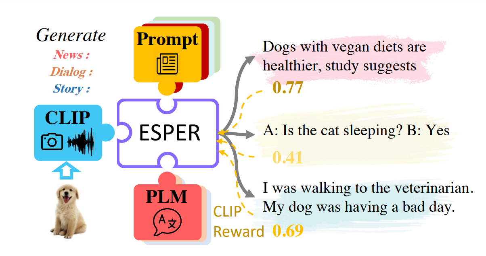

# Fusing Pre-trained Language Models with Multimodal Prompts through Reinforcement Learning

This repository contains the code for our CVPR 2023 paper:
***Fusing Pre-trained Language Models with Multimodal Prompts through Reinforcement Learning*** <br>
Youngjae Yu\*, Jiwan Chung\*, Heeseung Yun, Jack Hessel, Jae Sung Park, Ximing Lu, Rowan Zellers, Prithviraj Ammanabrolu, Ronan Le Bras, Gunhee Kim, Yejin Choi (\*: equal contribution) <br>



## Training ESPER

1. Training domain-specific text generators: Refer to [Text](/text/README.md)
2. Training ESPER (RL): Refer to [VL](/train/README.md)

# ESP Dataset

ESP is a new dataset with focus on providing ***multiple styled text targets for the same image***.
We release ESP dataset in `/data/dataset_v_0_2.json`.
The images of ESP dataset is a subset of the [COCO 2014 dataset](https://cocodataset.org/#home) validation split.

An example from the dataset is as following:

```
{
  "caption_sns": "Ready for the local team beach tennis match.  Here we are waiting on opponents!",
  "caption_news": "Tourists flock to area for the local beach tennis tournament.",
  "caption_instruction": "One of the best ways to get better at tennis. Is to practice on dirt. So, look on google for local dirt tennis courts online. Then, wait for a sunny day, and gather some friends.",
  "image_id": 17927,
  "id": 988
}
```

The example shows three text with different styles (social media, news, and instruction) conditioned on the same image.

## FAQ

- Are you releasing the ESPER-pre-trained weights in the future?
  - Yes. We are currently tidying up the code and finding a reliable source for file sharing.
- Are you releasing the finetuned weights for each downstream task?
  - No. You can easily finetune ESPER weights using standard teacher forcing.
- Will the data-specific training codes be available?
  - Yes. Please wait while we clean up the codes for better usability.
- Will the finetuning codes be available?
  - No. However, since ESPER is simply CLIPCap architecture-wise, you can easily finetune it on any vision-to-language generation data yourself.
